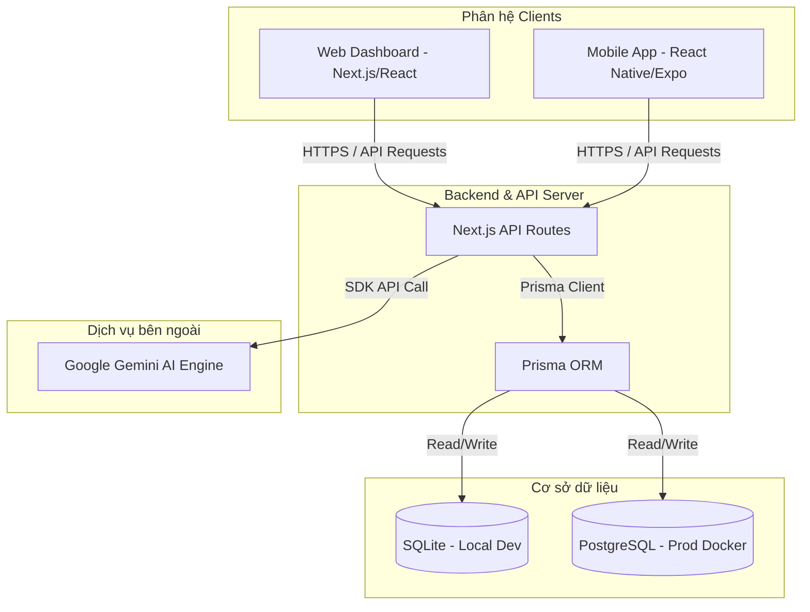

# GaraTP — Hệ thống Quản lý & Chăm sóc Gara Ô tô Trường Phát

> **ĐỒ ÁN TỐT NGHIỆP ĐẠI HỌC — NGÀNH CÔNG NGHỆ THÔNG TIN**
>
> Hệ thống đa nền tảng số hóa quy trình quản lý xưởng dịch vụ ô tô gồm **Web Dashboard quản trị** (Next.js), **Mobile App khách hàng** (React Native/Expo) và tích hợp **Trí tuệ nhân tạo (AI Assistant)** hỗ trợ chẩn đoán lỗi xe thông minh.

---

## 🎯 1. Mục tiêu đồ án (Objectives)

Đồ án nhằm giải quyết triệt để các hạn chế của quy trình vận hành thủ công tại các gara ô tô truyền thống bằng cách xây dựng một hệ sinh thái số hóa toàn diện:
1. **Số hóa quy trình vận hành**: Quản lý thông tin xe, khách hàng, lập phiếu tiếp nhận, phân công kỹ thuật viên, theo dõi tiến độ sửa chữa theo thời gian thực và in hóa đơn thanh toán tự động.
2. **Nâng cao trải nghiệm khách hàng**: Cung cấp ứng dụng di động cho khách hàng chủ động đặt lịch hẹn theo khung giờ trống, tra cứu lịch sử bảo dưỡng và xem hình ảnh nghiệm thu thực tế của từng hạng mục công việc.
3. **Ứng dụng Trí tuệ nhân tạo (AI)**: Tích hợp mô hình ngôn ngữ lớn (LLM - Gemini 1.5 Flash) đóng vai trò trợ lý ảo giúp kỹ thuật viên chẩn đoán nhanh lỗi xe dựa trên triệu chứng và tự động gợi ý các phụ tùng cần thay thế, nâng cao năng suất làm việc.

---

## 🏗️ 2. Kiến trúc hệ thống (Architecture)

Hệ thống được thiết kế theo kiến trúc **Client-Server** đa nền tảng, phân tách rõ ràng giữa các phân hệ:



### Chi tiết các thành phần kiến trúc:
*   **Web Dashboard (Next.js 16 / React 19 / Tailwind CSS)**: Dành cho Quản trị viên và Kỹ thuật viên. Đảm nhận nhiệm vụ quản lý lịch hẹn, lập phiếu sửa chữa, quản lý kho phụ tùng, tải lên ảnh nghiệm thu và xem báo cáo doanh thu trực quan (qua thư viện Recharts).
*   **Mobile App (React Native / Expo SDK 54)**: Dành cho Khách hàng. Đăng nhập nhanh bằng số điện thoại và biển số xe, hiển thị lịch trống thời gian thực của gara để đặt lịch hẹn và nhận thông báo đẩy.
*   **Backend API (Next.js API Routes)**: Cung cấp hệ thống REST API bảo mật cho cả bản Web và Mobile. Xác thực người dùng bằng cơ chế JWT qua HTTP-only cookies và xử lý logic nghiệp vụ.
*   **AI Core Integration**: Kết nối trực tiếp với Google Gemini API thông qua SDK `@google/generative-ai` để phân tích triệu chứng xe và đề xuất giải pháp xử lý.
*   **Database Layer**: Sử dụng **Prisma ORM** giúp dễ dàng chuyển đổi linh hoạt cơ sở dữ liệu từ **SQLite** ở môi trường phát triển cục bộ sang **PostgreSQL** trong môi trường chạy thực tế (production).

---

## 🛠️ 3. Các phần mềm cần thiết để triển khai (Prerequisites)

### 3.1 Môi trường phát triển cục bộ (Local Development)
*   **Node.js**: Phiên bản LTS mới nhất (Khuyến nghị bản **18** hoặc **20** trở lên).
*   **Git**: Dùng để quản lý mã nguồn.
*   **Expo Go**: Tải sẵn trên điện thoại thông minh (Android/iOS) để quét mã QR chạy thử app di động.

### 3.2 Môi trường triển khai thực tế (Production Deployment)
*   **Docker & Docker Compose**: Để đóng gói và vận hành ứng dụng cô lập trong container.
*   **Hệ điều hành**: Máy chủ ảo VPS cài hệ điều hành **Ubuntu Server 20.04/22.04 LTS**.
*   **Caddy hoặc Nginx**: Để cấu hình Reverse Proxy hướng luồng tên miền vào ứng dụng và tự động cấp chứng chỉ HTTPS (SSL) bảo mật.

---

## 🚀 4. Cách thức chạy chương trình (Execution Guide)

### 4.1 Chạy dưới môi trường phát triển (Local Development)

#### A. Cấu hình & Chạy Web API Server (Next.js)
1. Cài đặt các thư viện phụ thuộc:
   ```bash
   npm install
   ```
2. Thiết lập biến môi trường:
   * Copy tệp `.env.example` thành `.env` ở thư mục gốc:
     ```bash
     cp .env.example .env
     ```
   * Mở file `.env` mới tạo và điền các khóa bí mật của bạn (`JWT_SECRET`, `GEMINI_API_KEY`).
3. Khởi tạo cơ sở dữ liệu SQLite cục bộ và nạp dữ liệu mẫu:
   ```bash
   npx prisma migrate dev --name init
   npx prisma db seed
   ```
   *(Tài khoản mặc định: Admin `admin` / `123`; Kỹ thuật viên: `tech1` / `123`)*
4. Chạy dự án trên mạng cục bộ (LAN) để điện thoại di động kết nối được:
   ```bash
   npm run dev:lan
   ```
   * Màn hình quản trị: [http://localhost:3000/login](http://localhost:3000/login)

#### B. Cấu hình & Chạy Mobile App (Expo)
1. Di chuyển vào thư mục ứng dụng di động:
   ```bash
   cd mobile
   ```
2. Cài đặt các thư viện:
   ```bash
   npm install
   ```
3. Thiết lập biến môi trường:
   * Tạo tệp `.env` trong thư mục `mobile` từ mẫu `.env.example`.
   * Cập nhật địa chỉ IPv4 máy tính của bạn:
     ```env
     EXPO_PUBLIC_API_BASE_URL=http://<IP_VÀ_CỦA_MÁY_TÍNH>:3000
     ```
4. Khởi động Expo:
   ```bash
   npm start
   ```
   * Quét mã QR bằng ứng dụng **Expo Go** trên điện thoại để mở ứng dụng di động.

---

### 4.2 Triển khai thực tế với Docker (Production Deployment)

Hệ thống đã được tích hợp sẵn cấu hình Docker để bạn triển khai chỉ với một lệnh duy nhất trên VPS.

1. **Chuẩn bị trên máy chủ VPS**: Cài đặt Docker & Docker Compose và clone mã nguồn dự án về máy chủ.
2. **Thiết lập biến môi trường**: Đảm bảo tệp `.env` tại thư mục gốc trên VPS của bạn đã điền đầy đủ các thông tin bảo mật.
3. **Khởi chạy bằng Docker Compose**:
   ```bash
   docker compose up -d --build
   ```
   * Docker sẽ tự động chạy các bước: Build ứng dụng Next.js, tạo Container, chạy migrations cập nhật database, nạp dữ liệu mẫu và chạy ứng dụng ở cổng `3000`.
   * Toàn bộ dữ liệu của SQLite (`/app/db`) và hình ảnh vật chứng tải lên (`/app/public/uploads`) được liên kết với Docker Volume để đảm bảo **không bao giờ bị mất dữ liệu** khi bạn cập nhật code hoặc khởi động lại máy chủ.
